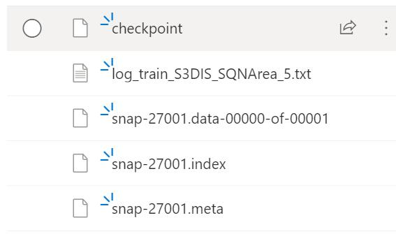

# SQN_tensorflow

This repo is an unofficial TensorFlow implementation of **[Semantic Query Network (SQN)](https://arxiv.org/abs/2104.04891)**. Yet, it **achieves comparable or even better performance on S3DIS** as the SQN paper (w/o any additional training strategies, e.g., re-training w. pseudo labels), **check [Results](#results) section** for details.

>This repo achieves a better performance (47.56% mIoU) on S3DIS w. only **0.01%** weak labels than the SQN paper, which obtains 45.30% mIoU w. 0.01% labels. Check its [checkpoint](https://hkustconnect-my.sharepoint.com/:f:/g/personal/cyinac_connect_ust_hk/EvFhPeuZKp5Hq8IR-XpsLJkB9EObsJHHFhOevRTzJ36mXg?e=TQbCJ3) for details.

## Requirements

The latest codes are tested on two Ubuntu settings:

- [x] Ubuntu 18.04, Nvidia 1080, CUDA 10.1, TensorFlow 1.13 and Python 3.6
- [ ] Ubuntu 18.04, Nvidia 3090, CUDA 11.3, TensorFlow 1.13 and Python 3.6

### Clone the repository

```
git clone https://github.com/PointCloudYC/SQN_tensorflow && cd SQN_tensorflow
```

### Setup python environment

create a conda environment

```
# DL is the conda env name
conda create -n DL python=3.5
source activate DL
pip install -r helper_requirements.txt
# compile the sub-sampling and knn op
sh compile_op.sh
```

For more details to set up the development environment, check [the official RandLA-Net repo](https://github.com/QingyongHu/RandLA-Net).

### Download S3DIS (and make a symlink)

You can download the S3DIS dataset from [here](https://goo.gl/forms/4SoGp4KtH1jfRqEj2") (4.8 GB). You only need to download the file named `Stanford3dDataset_v1.2.zip`, unzip and move (or link) it to a folder. (same as the RandLA-Net repo setting.)

```
# assume S3DIS dataset is downloaded at /media/yinchao/dataset/S3DIS
ln -s /media/yinchao/dataset/S3DIS ./data/S3DIS/Stanford3dDataset_v1.2_Aligned_Version   
```

### Preprocess S3DIS dataset

You can use the `s3dis-prepare-sqn.sh` script to prepare the S3DIS dataset with weak labels.

```
# prepare the dataset, each room (Note: each area is preprocessed in the CLoserLook3D code) will result in four files 1 file in the original_ply folder for raw_pc.ply, and 3 files in the input_0.040 for sub_pc.py, sub_pc.kdtree, and project_indices file for each raw point, check data_prepare_s3dis_sqn.py for details.

python utils/data_prepare_s3dis_sqn.py

# check #rooms in npy format, should be 272 rooms
find *.npy | wc -l
```

The data file structure should look like:

```
<root>
├── ...
├── data
│   └── S3DIS
│       └── Stanford3dDataset_v1.2_Aligned_Version
│           ├── Area_1
│           ├── Area_2
│           ├── Area_3
│           ├── Area_4
│           ├── Area_5
│           └── Area_6
│       └── input_0.040
│       └── original_ply
│       └── weak_label_0.01
└── ...
```

### Compile custom CUDA tf_ops

Only `tf_ops/3d_interpolation` CUDA ops need to be compiled, which will used for three trilinear interpolation.

check the `tf_interpolate_compile.sh`; You may need to tailor the `CUDA_ROOT` and `TF_ROOT` path according to your own system.

```
#/bin/bash
CUDA_ROOT="/usr/local/cuda-10.1"
TF_ROOT="/home/yinchao/miniconda3/envs/DL/lib/python3.6/site-packages/tensorflow"

# TF1.4 (Note: -L ${TF_ROOT} should have a space in between)
g++ -std=c++11 tf_interpolate.cpp -o tf_interpolate_so.so -shared -fPIC -I ${TF_ROOT}/include -I ${CUDA_ROOT}/include -I ${TF_ROOT}/include/external/nsync/public -lcudart -L ${CUDA_ROOT}/lib64/ -L ${TF_ROOT} -ltensorflow_framework -O2 # -D_GLIBCXX_USE_CXX11_ABI=0
```

For more details, check [Charles' PointNet2](https://github.com/charlesq34/pointnet2)

## Training

To train the SQN, run this command:

```
python main_S3DIS_Sqn.py \
--gpu 0 \
--mode train \
--test_area 5
```

>For more arguments, see `main_S3DIS_Sqn.py` or use `python main_S3DIS_Sqn.py --help` to see documentation.

P.S.: you can use `run-s3dis-Sqn.sh` bash script to train multiple settings or do ablation study.

## Evaluation

To evaluate our model on S3DIS, run:

```
python main_S3DIS_Sqn.py \
--gpu 0 \
--mode test \
--test_area 5
```

>For more arguments, see `main_S3DIS_Sqn.py` or use `python main_S3DIS_Sqn.py --help` to see documentation.


## Results

Our SQN achieves the following performance on S3DIS:
>We use Nvidia 1080 GPU to train the replicated SQN with a small batch size; The performance might be improved if a powerful GPU w. larger memory could be used. We will update this performance table with a Nvidia 3090 in the future.

| Model | Weak ratio | mIoU(%) | Description|
|-------|------------|-----------------------|------------|
| SQN(Official)|100%| 63.73| trained with full labels|
| SQN(Official)|10%| 64.67| Note: add **retrain w. pseudo labels**|
| SQN(this repo)|10%| in progress| no retraining w. pseudo labels|
| SQN(Official)|1%| 63.65| Note: add **retrain w. pseudo labels**|
| SQN(this repo)|1%|in progress| no retraining w. pseudo labels|
| SQN(Official)|0.1%| 61.41| Note: add **retrain w. pseudo labels**|
| SQN(this repo)|0.1%| 55.10 | no retraining w. pseudo labels|
| SQN(Official)|0.01%| 45.30| Note: add **retrain w. pseudo labels**|
| SQN(this repo)|0.01%| **47.56** | no retraining w. pseudo labels|
| SQN(this repo)|0.0067%| **46.81** | no retraining w. pseudo labels|

Note: experiments are still in progress due to my slow GPU. Stay in tuned.
>Those numbers surpassing the official SQN is highlighted in bold in the table.


## Pre-trained Models

You can download pre-trained models and training log here:

- [weak ratio 10% (todo)](TODO)
- [weak ratio 1% (todo)](TODO)
- [weak ratio 0.1%](https://hkustconnect-my.sharepoint.com/:f:/g/personal/cyinac_connect_ust_hk/EoS3AYSkrxZLovTfRvyV6xABGsDtOZxiu6bgBcAe0-S-dw?e=7JcwSr)
- [weak ratio 0.01% ](https://hkustconnect-my.sharepoint.com/:f:/g/personal/cyinac_connect_ust_hk/EvFhPeuZKp5Hq8IR-XpsLJkB9EObsJHHFhOevRTzJ36mXg?e=TQbCJ3)
- [weak ratio 0.0067%](https://hkustconnect-my.sharepoint.com/:f:/g/personal/cyinac_connect_ust_hk/EsMOq5fqavpOv2ayemdK9boB8-u22eFTcCDWQSPJSN7SbA?e=ivlXAA)


Each check point folder has the following files:



Use the below script to run checkpoint model on S3DIS:

```
python -B main_S3DIS_Sqn.py \
--gpu 0 \
--mode test \
--test_area 5 \
--model_path [your_checkpoint_path, e.g., /path/xx/snap-27001; no need add the file extension]
```

## Acknowledgements

Our pytorch codes borrowed a lot from [official RandLA-Net](https://github.com/QingyongHu/RandLA-Net) and the custom trilinear interoplation CUDA ops are modified from [official Pointnet2](https://github.com/charlesq34/pointnet2).

## TODOs

- [ ] **re-train w. pseudo labels to further improve performance**
- [ ] **apply self-supervised learning techniques, e.g., Contrastive Learning**.
- [ ] implement the training strategy mentioned in the Appendix of the paper.
- [ ] ablation study
- [ ] benchmark weak supervision
- [x] dataset preparation implementation
- [x] SQN architecture implementation consisting of encoder and query network
- [x] training an evaluation loop modification


## Citation

If you find our work useful in your research, please consider citing:

```
@code{SQN_tensorflow_yc,
    Author = {YIN, Chao},
    Title = {SQN TensorFlow implementation},
    Journal = {https://github.com/PointCloudYC/SQN_tensorflow},
    Year = {2021}
   }

@article{hu2021sqn,
    title={SQN: Weakly-Supervised Semantic Segmentation of Large-Scale 3D Point Clouds with 1000x Fewer Labels},
    author={Hu, Qingyong and Yang, Bo and Fang, Guangchi and Guo, Yulan and Leonardis, Ales and Trigoni, Niki and Markham, Andrew},
    journal={arXiv preprint arXiv:2104.04891},
    year={2021}
  }
```
